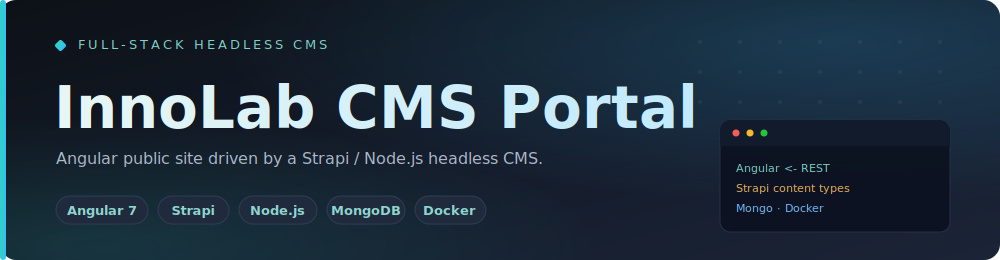

<div align="center">



<br/>

<a href="https://github.com/A7med-Sghaier/innolab-cms-portal">
  
</a>

<br/><br/>

[](https://github.com/A7med-Sghaier/innolab-cms-portal/actions/workflows/ci.yml)
[](https://angular.io)
[](https://strapi.io)
[](https://nodejs.org)
[](https://www.mongodb.com)


</div>

A university content-management website: an **Angular** public front end rendering structured
content from a **Strapi / Node.js** headless CMS, with custom content types for articles, projects,
studies, students, and team members — all backed by **MongoDB**.

> [!NOTE]
> A **portfolio-safe cleanup** of the original LMU project: sanitized demo seed data, neutral
> placeholder media, environment-driven config, and a one-command Docker workflow. Copyrighted
> live-site assets and production dumps are intentionally excluded.

<div align="center"></div>

## Live Site Reference

The original public InnoLab website is available at [https://innolab.ifi.lmu.de](https://innolab.ifi.lmu.de).

This repository is not presented as the official LMU/InnoLab source release. The local Docker demo uses sanitized sample records and neutral placeholder images. Copyrighted live-site images, database dumps, and production content are not copied into this repository.

<div align="center"></div>

## Portfolio Value

- Full-stack JavaScript application with a separated frontend and backend.
- Angular component architecture for rendering content sections, cards, tables, news, and carousel views.
- Strapi-based CMS backend with custom content types for articles, projects, studies, students, team members, and page views.
- MongoDB configuration moved to environment variables for safer public repository publishing.
- Shell-script Docker workflow added for repeatable local startup across macOS and Linux.
- Portfolio-safe demo seed data added for local Docker startup.
- Database dumps and generated artifacts excluded from version control.
- Copyright-sensitive media replaced with neutral demo placeholders.
- GitHub Actions workflow added for repeatable frontend build validation.

<div align="center"></div>

## Tech Stack

| Area | Technology |
| --- | --- |
| Frontend | Angular 7, TypeScript, SCSS, Angular Material, Bootstrap |
| Backend | Node.js, Strapi, Koa, REST APIs |
| Database | MongoDB via `strapi-hook-mongoose` |
| Local Runtime | Docker Compose, Node.js 10, MongoDB 4.2 |
| Tooling | Shell scripts, npm scripts, GitHub Actions |

<div align="center"></div>

## Repository Structure

```text
.
├── run.sh                   # Main local Docker entrypoint
├── docker-compose.yml       # Runs frontend, backend, and MongoDB together
├── innolab-front/           # Angular public website
├── innolab-server/          # Strapi CMS and REST API
├── scripts/                 # Local development helper scripts
├── db_dumps/                # Demo seed script; original DB dumps are excluded
│   └── init-demo-data.js    # Portfolio-safe local demo data
├── docs/                    # Architecture and publishing notes
└── .github/workflows/       # CI workflow
```

<div align="center"></div>

## Getting Started With Docker

Docker is the recommended local setup because the project uses older Angular, Strapi, Node.js, and MongoDB versions.

### Prerequisites

- Docker Desktop, or Docker Engine with Docker Compose support

### Run All Apps

From the repository root:

```bash
sh run.sh up
```

Or simply:

```bash
sh run.sh
```

The shell script detects the operating system and chooses the right Docker Compose command. On macOS it prefers `docker-compose`; on Linux it prefers `docker compose` and falls back when needed.

The first run builds the frontend and backend images, installs dependencies inside Docker, starts MongoDB, seeds demo content, and then starts both apps.

### Local URLs

```text
Frontend:          http://localhost:4200
Backend API:       http://localhost:12220
Strapi server:     http://localhost:1337
MongoDB from host: localhost:27018
MongoDB in Docker: mongo:27017
```

The Docker MongoDB host port is `27018` on purpose so it does not conflict with a MongoDB service already running on your Mac at `27017`.

### Demo Seed Data

The original MongoDB dump is not included because it may contain university-owned or non-public content. For local portfolio review, Docker seeds a small demo dataset from `db_dumps/init-demo-data.js` when the MongoDB volume is first created.

The seed data:

- creates a minimal `dbs_view` record so the frontend has a page response to render;
- inserts sample project records;
- uses neutral placeholder image URLs instead of copyrighted live-site media.

To rerun the seed from a clean database:

```bash
sh run.sh clean
sh run.sh up
```

Verify the seeded API response:

```bash
curl http://localhost:12220/view/dbs_view
```

Verify project image references in MongoDB:

```bash
docker-compose exec mongo mongo -u innolab -p innolab-local-password --authenticationDatabase admin innolab_dev --quiet --eval "db.projects.find({}, {title: 1, image: 1}).pretty()"
```

### Docker Commands

```bash
sh run.sh up       # Build and start all services
sh run.sh logs     # Follow service logs
sh run.sh down     # Stop services, keep MongoDB data volume
sh run.sh clean    # Stop services and remove MongoDB/node_modules volumes
sh run.sh restart  # Stop, rebuild, and start again
sh run.sh ps       # Show container status
```

The `npm run docker:*` commands are kept as aliases for convenience, but the shell script is the recommended workflow.

If Docker Desktop on Apple Silicon has trouble with old `node-sass` binaries, keep the Compose `platform: linux/amd64` settings. They are intentional for this legacy Node 10 stack.

<div align="center"></div>

## Manual Local Setup

Use this only if you want to run the apps without Docker.

### Prerequisites

This project was originally built with older Angular and Strapi versions. Use the repository `.nvmrc`:

- Node.js 10.x
- npm 6.x
- MongoDB running locally on `127.0.0.1:27017`, or a MongoDB instance configured through environment variables

With `nvm`:

```bash
nvm install
nvm use
```

If you previously installed dependencies with another Node/npm version, remove them before reinstalling:

```bash
rm -rf innolab-server/node_modules innolab-front/node_modules
rm -f innolab-server/package-lock.json innolab-front/package-lock.json
```

The backend entrypoint includes compatibility shims for this legacy Strapi/Node 10 stack, including modern transitive dependency compatibility and local Docker startup fixes for old upload relations.

### Configure Environment

Copy the sample backend environment file:

```bash
cp innolab-server/.env.example innolab-server/.env
```

For local development, the backend defaults to:

```text
DATABASE_HOST=127.0.0.1
DATABASE_PORT=27017
DATABASE_NAME=innolab_dev
```

Leave `DATABASE_URI` empty unless you intentionally use a full MongoDB connection string in another environment.

### Install and Run Backend

```bash
cd innolab-server
npm install
npm start
```

The backend defaults to:

```text
http://localhost:12220
```

### Install and Run Frontend

```bash
cd ../innolab-front
npm install
npm start
```

The Angular app defaults to:

```text
http://localhost:4200
```

<div align="center"></div>

## Useful Commands

From the repository root:

```bash
sh run.sh up
sh run.sh logs
sh run.sh down
sh run.sh clean
npm run install:all
npm run start:server
npm run start:front
npm run build:front
npm run lint:front
```

<div align="center"></div>

## Security and Publishing Notes

- Original database dumps are intentionally excluded from the repository.
- Demo data is sanitized and portfolio-safe.
- Copyrighted live-site images are not copied, embedded, or used as seed media.
- Neutral placeholder images are used for local demo records.
- MongoDB credentials are local Docker development credentials only.
- Session and CSRF secrets are local Docker development defaults only.
- Review [docs/publish-checklist.md](docs/publish-checklist.md) before changing repository metadata or demo content.
- If realistic production-like demo data is needed later, create sanitized original seed data or use assets with explicit permission.

<div align="center"></div>

## Portfolio Positioning

Full-stack CMS portal demonstrating Angular, Node.js, Strapi, MongoDB, content modeling, REST integration, Dockerized local development, and safe repository cleanup for public portfolio presentation.

<div align="center"></div>

<div align="center">

### Built by Ahmed Sghaier — Senior Full-Stack Engineer

[](https://www.linkedin.com/in/ahmed-sghaier-449778137)
[](mailto:a7mado008@gmail.com)
[](https://github.com/A7med-Sghaier)

</div>
